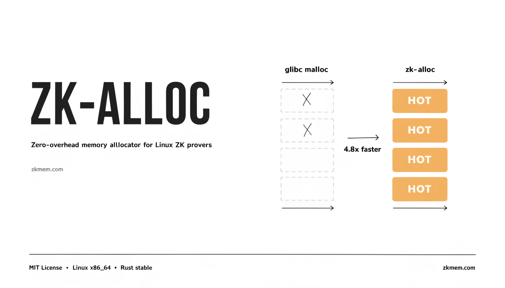

# zk-alloc

High-performance Linux allocator for ZK provers — keeps large buffers resident across proof rounds to eliminate page-fault overhead.

[](https://zkmem.com/zk-alloc)
[](LICENSE-MIT)

<p align="center">
  
</p>

General-purpose allocators are built for long-lived, mixed workloads. A prover
is the opposite. A few worker threads churn through enormous, short-lived,
power-of-two buffers — FFT/NTT coefficient vectors, MSM bucket arrays, trace
columns — allocating and freeing gigabytes on every proof round. The default
allocator returns those freed pages to the kernel, so the next round faults and
zeroes them all over again: a page-fault storm sitting right on the critical
path.

zk-alloc keeps them instead.

## How it works

- **Large allocations are cached, resident, by size class.** Anything from
  64 KiB up is rounded to a size class and parked in a pool of live mappings.
  The next request of that class reuses an already-faulted region — no syscall,
  no re-zeroing. This is where the speedup comes from.
- **The cache is sharded per thread**, so concurrent provers rarely contend,
  and regions are fungible: a buffer freed on one thread can be reused on any
  other with no cross-thread handoff.
- **Regions are advised for transparent huge pages** (`madvise(MADV_HUGEPAGE)`)
  to cut TLB pressure on the big arrays. No hugetlb pool setup is required, but
  the host's THP must be enabled (`madvise` or `always` in
  `/sys/kernel/mm/transparent_hugepage/enabled`); where it is disabled — some
  VMs and containers — this is simply a no-op, not an error.
- **Small allocations go to the system allocator**, which already handles a
  `Box<T>` or a short `String` well — there's nothing to gain by reimplementing
  it, so we don't.

Classification is free: `dealloc` is handed the same `Layout` it was allocated
with, so the size class is recomputed directly from the size. There is no
per-allocation header and no global address table on the path.

## Benchmarks

Synthetic patterns drawn from real prover code (`benches/zk_patterns.rs`), each
allocator installed globally and measured head-to-head on one 16-core Linux
box. These are micro-benchmarks of the allocation pattern, not a full prover —
treat them as indicative. Median times; lower is better.

**A coefficient vector allocated, filled with data, and freed every round** (the
FFT/NTT loop — the prover's hot path):

| FFT buffer | glibc | jemalloc | mimalloc | zk-alloc |
|-----------:|------:|---------:|---------:|----------:|
| 8 MB       | 215 µs | 2.09 ms | 199 µs  | **203 µs** |
| 32 MB      | 9.7 ms | 9.8 ms  | 1.83 ms | **1.85 ms** |
| 128 MB     | 41 ms  | 41 ms   | 10.9 ms | **9.6 ms** |

**A burst of large buffers allocated then freed together** (a proof-phase
boundary), and **`2^c` MSM bucket arrays** (zero-initialized, sparsely used):

| Pattern          | glibc  | jemalloc | mimalloc | zk-alloc |
|------------------|-------:|---------:|---------:|----------:|
| phase burst      | 545 µs | 57 µs    | 5.05 ms  | **60 µs** |
| MSM buckets (6 MB×16) | 31 ms | 25 ms | 7.5 ms   | **7.3 ms** |

What the numbers say:

- **On large data-fill, zk-alloc and mimalloc both keep regions resident and
  run 4–5× faster than glibc and jemalloc.** jemalloc never thread-caches
  multi-megabyte objects, so it pays the kernel fault-and-zero cost every round
  (and is oddly slow at 8 MB, where its decay churns the mapping).
- **zk-alloc edges mimalloc on the largest buffers** — where its transparent
  huge pages cut the most TLB pressure — which is exactly where provers spend
  their memory.
- **On zero-initialized bursts, zk-alloc matches jemalloc and leaves mimalloc
  far behind.** Both jemalloc and zk-alloc re-zero a reused region *lazily*
  (`MADV_DONTNEED`: untouched pages never fault); mimalloc eagerly memsets it.
  zk-alloc has both behaviours — resident reuse for data-fill, lazy zeroing for
  `calloc` — so it is never the one left behind.

Reproduce (one allocator per build, chosen by feature):

```sh
cargo bench --bench zk_patterns                            # glibc
cargo bench --features bench-jemalloc --bench zk_patterns  # jemalloc
cargo bench --features bench-mimalloc --bench zk_patterns  # mimalloc
cargo bench --features bench-global   --bench zk_patterns  # zk-alloc
```

### Scaling under parallelism

Provers are parallel (rayon), so the question is how an allocator behaves when
many cores allocate large buffers at once. Each thread repeatedly allocates a
**64 MB** buffer (above glibc's mmap threshold, so glibc and jemalloc both
`munmap` and re-fault it), touches every page, and frees it. Aggregate
throughput, GB/s, higher is better:

| threads | glibc | jemalloc | mimalloc | zk-alloc |
|--------:|------:|---------:|---------:|----------:|
| 1       | 3.7   | 3.7      | 12.9     | **13.3**  |
| 4       | 11.0  | 11.5     | 20.6     | **21.1**  |
| 16      | 13.1  | 18.5     | 20.7     | **20.6**  |

zk-alloc and mimalloc reuse resident regions and hit memory-bandwidth
saturation (~20 GB/s) by four threads; glibc and jemalloc pay the fault-and-zero
cost on every buffer and never catch up (glibc plateaus, jemalloc only closes
the gap by 16 threads). Against jemalloc — the allocator most provers actually
run — that is a **3× throughput edge** on large buffers. Against mimalloc it is
a tie here (mimalloc is excellent; the two are within noise).

```sh
cargo run --release --example contention --features bench-jemalloc -- 64 3
cargo run --release --example contention --features bench-global   -- 64 3
```

### On a real prover — read this before you expect a speedup

The numbers above isolate the *allocation* cost. A real proof also does a lot of
arithmetic, and when proving is **compute-bound the allocator is not the
bottleneck**. Proving a ~2^17 plonky2 circuit (repeated squaring) on the same
box, best of 6 rounds:

| Allocator | Prove time | Peak RSS |
|-----------|-----------:|---------:|
| glibc     | 7.52 s     | 4.7 GB   |
| jemalloc  | 7.52 s     | 4.7 GB   |
| zk-alloc | 7.44 s     | 5.9 GB   |

All three are within noise. The FFTs and Poseidon hashing dominate; the cache
hits 73% but saves time that is lost in the arithmetic. zk-alloc holds ~1 GB
more resident (its cache) for no real gain here.

So be honest with yourself about your workload:

- **Allocation/fault-bound** (very large circuits whose buffers dwarf the
  compute, memory-constrained boxes that are paging, repeated proving of huge
  FFTs, or a profile that shows real time in page faults / `madvise`): this is
  where the 4–5× shows up.
- **Compute-bound** (a typical mid-size proof): expect parity. Use zk-alloc for
  its arena and witness tooling, not for a speedup that isn't there.

Measure your own prover with `stats()` and a profiler before switching. The
honest default ceiling (below) makes zk-alloc *do no harm* if it doesn't help.

## Usage

### As a global allocator

```rust
use zk_alloc::ZkAlloc;

#[global_allocator]
static GLOBAL: ZkAlloc = ZkAlloc::new();
```

Put this in your **binary or benchmark, not in a library**. A library that sets
`#[global_allocator]` forces the choice on everything downstream, and the global
allocator can only be set once per build. (This is also why halo2, plonky2, and
friends leave it to the final binary.)

### Scoped arena

For a phase whose scratch buffers all die together — witness generation, a
commitment round — an [`Arena`] bump-allocates and frees everything at once in
O(1):

```rust
use zk_alloc::Arena;

let arena = Arena::with_capacity(256 * 1024 * 1024)?;
let scratch = arena.alloc_array::<u64>(1 << 20);
// ... use scratch for the phase ...
unsafe { arena.reset() };   // O(1); all pointers from the arena are now invalid
# Ok::<(), zk_alloc::MapFailed>(())
```

### Secret witness data

[`SecretBuf`] is a swap-locked (`mlock`), guard-fenced, wipe-on-drop buffer for
private inputs:

```rust
use zk_alloc::SecretBuf;

let mut witness = SecretBuf::new(4096)?;
witness.as_mut_slice()[0] = 42;
// ... wiped with explicit_bzero when dropped ...
# Ok::<(), zk_alloc::MapFailed>(())
```

It protects the buffer, not copies you make elsewhere: a value read into a local
lives in registers and on the stack, beyond its reach.

## Tuning

- The cache holds up to **`min(RAM/8, 1 GiB)`** by default — deliberately
  conservative so it never balloons RSS on a workload it doesn't help. Override
  with `ZK_ALLOC_CACHE_BYTES` (in bytes); raise it when proving is genuinely
  allocation-bound and you have the memory. This is the lever between proving
  speed (a bigger cache stays warmer) and resident footprint.
- `zk_alloc::stats()` reports the cache hit rate — useful for confirming the
  cache is actually being reused for your workload.
- `zk_alloc::soften_cache()` hints the cached regions reclaimable under memory
  pressure (`MADV_FREE`) while keeping them warm; `zk_alloc::release_cache()`
  hands the address space back outright. Call one between unrelated jobs.

## Memory footprint

zk-alloc trades resident memory for speed: a warm cache *is* held memory. If
you are memory-bound rather than latency-bound, lower `ZK_ALLOC_CACHE_BYTES`,
or call `soften_cache()` / `release_cache()` when a prover goes idle.

## Platform

Linux only. The allocator depends on `mmap`/`madvise` semantics
(`MADV_HUGEPAGE`, `MADV_FREE`) with no portable equivalent. Other platforms are
out of scope for now.

## License

Licensed under either of [MIT](LICENSE-MIT) or [Apache-2.0](LICENSE-APACHE) at
your option.
